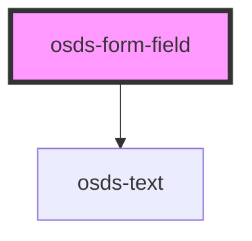

# osds-form-field

<!-- Auto Generated Below -->

## Properties

| Property | Attribute | Description                                                                | Type                   | Default                    |
| -------- | --------- | -------------------------------------------------------------------------- | ---------------------- | -------------------------- |
| `error`  | `error`   | Indicates if the Form Field shows error or not                             | `string \| undefined`  | `DEFAULT_ATTRIBUTE.error`  |
| `inline` | `inline`  | Indicates if the Form Field is full width or not: see component principles | `boolean \| undefined` | `DEFAULT_ATTRIBUTE.inline` |

## Slots

| Slot          | Description       |
| ------------- | ----------------- |
| `"(unnamed)"` | FormField content |

## Dependencies

### Depends on

- [osds-text](../../../../text/src/components/osds-text)

### Graph

----------------------------------------------

*Built with [StencilJS](https://stenciljs.com/)*
