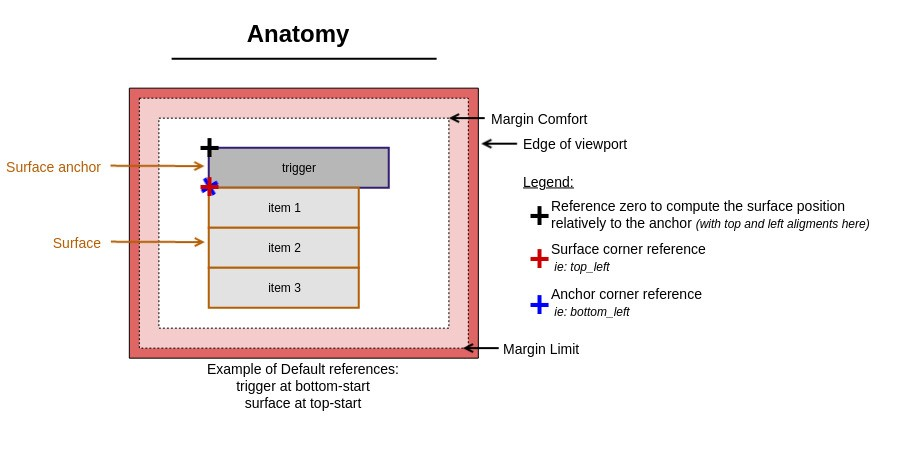
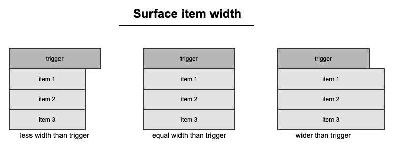
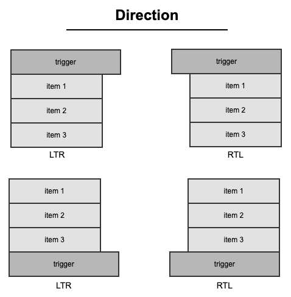
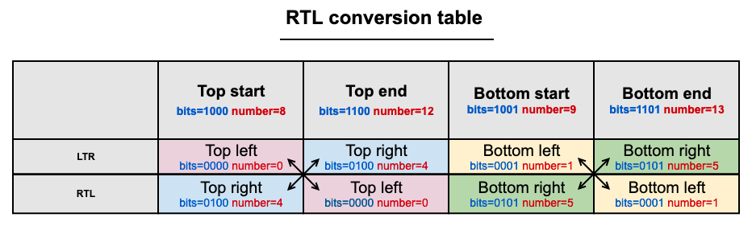
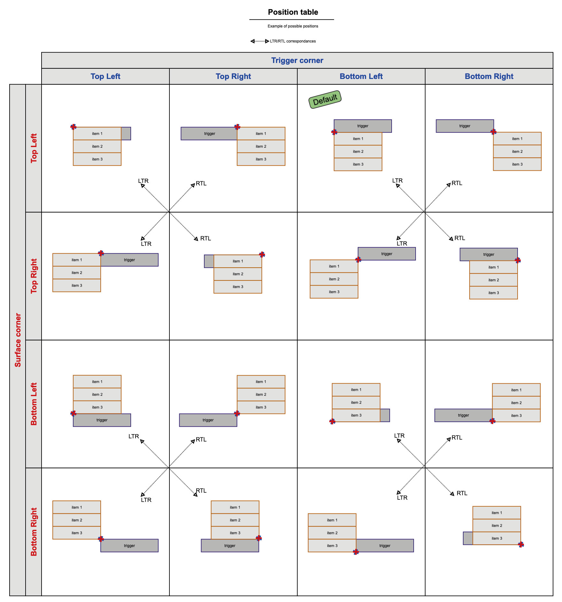
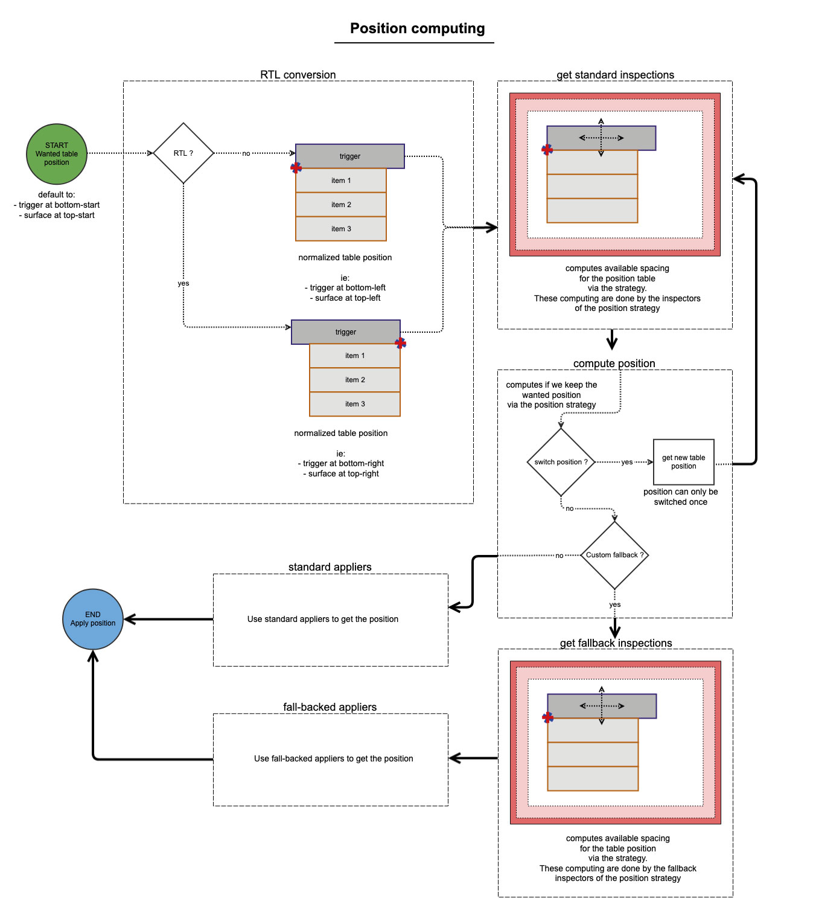
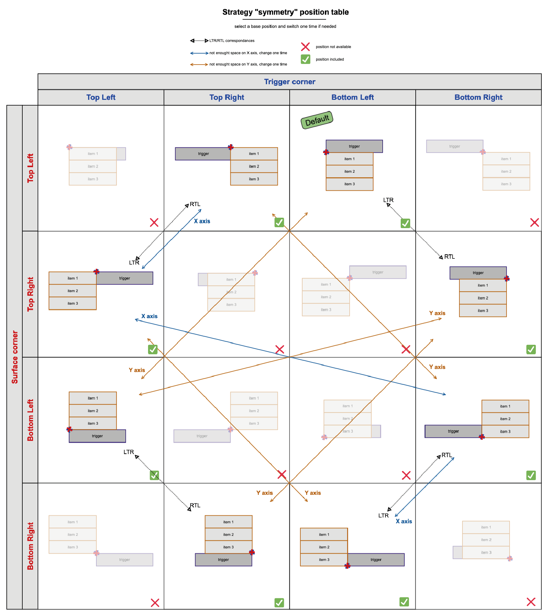
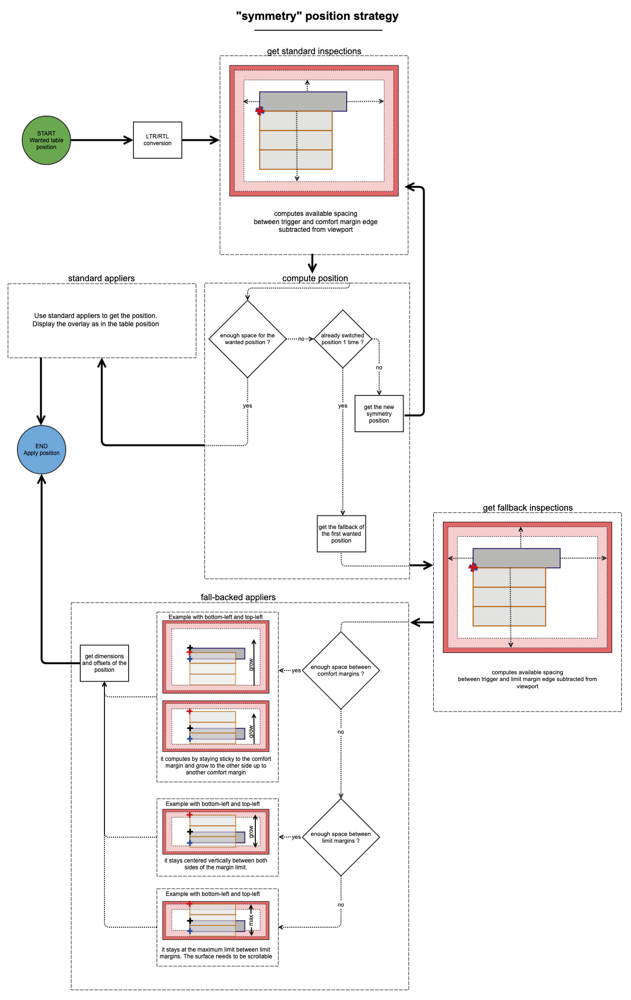

# OvhCloud Component Development Kit

See all documentation in `doc` directory.

1. [Overlay Introduction](#overlay-introduction)
2. [Overlay System](#overlay-system)
3. [Symmetry strategy](#symmetry-strategy)
4. [Usage](#usage)

## Overlay Introduction

The `OVHcloud Component Development Kit` helps you to make overlay easier.
It can be useful to build this kind of components:

- `select`: a component that allows the user to select a value of a list.
  Usually, the content of the list will be displayed just below.
- `tooltip`: if you want to develop a component that displays a help text when the user hovers an element
- `menu`: you want to build a menu with items displayed in the foreground and the user can choose an item from the list

You can read the `Usage` page if you want to start quickly, but we recommend to understand the system under the hood
in the corresponding page too.

Documentation:
- [System](?path=/docs/cdk-overlay-system--page): understand how works the positioning system
- [Usage](?path=/docs/cdk-overlay-usage--page): follow the guide to build overlays
- [Symmetry position strategy](?path=/story/cdk-overlay-strategies-symmetry--page): default embedded position strategy

Example of uses:
- [Basic](https://ovh.github.io/design-system/latest/?path=/story/ovhcloud-component-development-kit-examples-basic--basic): basic usage in vanilla
- [Stencil Select](https://ovh.github.io/design-system/latest/?path=/story/ovhcloud-component-development-kit-examples-stencil-select--select): how to use it for a stencil's made Select component
- [Stencil Tooltip](https://ovh.github.io/design-system/latest/?path=/story/ovhcloud-component-development-kit-examples-stencil-tooltip--tooltip): how to use it for a stencil's made Tooltip component

## Overlay System

The overlay system of `ODS CDK` is based on a web component we call `surface`.
A `surface` is used to display content in the foreground, such as menu, select or tooltip, etc.:
this is the overlay concept. It is very common to all User Interface components.
This is why the overlay system is implemented in `ODS CDK`: it helps developers to make overlays simpler!

The `surface` will be displayed after a user action or programmatically.

### Principles

In order to make it works, it needs to be anchored to an element: this is the `trigger` and it represents an anchor for
the `surface`.

Depending on how you configure the `surface`, it will be displayed at some computed coordinates `(x,y)` relatively to
this `anchor`.

The overlay (the `surface`) position is computed by placing two references at the same coordinates:

- an `anchor corner` reference (that corresponds to the trigger)
- a `surface corner` reference (that corresponds to the content of the overlay)

A `corner` can be placed to the different corner of an HTML
element: `top left`, `top right`, `bottom left`, `bottom right`.

As the overlay system is compatible with the `Right To Left` HTML directionality,
we can define the `corner` references also with: `top start`, `top end`, `bottom start`, `bottom end`.
The `start` or `end` notions will be replaced by the correct `left` or `right` depending on the directionality you defined
in your app.

At the end, the `surface` is linked to his `anchor` via their `corner` references.

All the positions are computed thanks to `position strategies`.
By default, `ODS CDK` has a built-in `strategy` called `symmetry` but you can define your own strategy.

The system works with two different margins:

- a comfort margin: for instance, in comfort mode, the `surface` positioning avoids the edges of the viewport
- a limit margin: for instance, in limit mode, we allow the `surface` to overlap the comfort margin up to the margin limit

the meaning and behavior of the margins are defined inside the `strategy`.

By default, the system will use these references:

- `trigger` at `bottom-start` corner
- `surface` at `top-start` corner



When the system will compute the position of the `surface`,
it will use one of the four corner of the `anchor` as the `zero` reference
in order to display at a certain coordinate, relatively to the surface.

You have all the control over the width of the `surface` in your component:


### Directionality

The system is compatible with the `RTL directionality`.
It detects automatically the direction.
You can find here some examples:


An `RTL` conversion table is used to translate the wanted position into the real positioning.
Each position corresponds to a specific bit and allows us to change easily the result,
depending on whether we are in `RTL` mode or not.

For instance, if you indicate `Top start` for the `surface corner` and you are in `LTR` mode,
the system will translate it to `Top left`:


### Position table

The overlay management works with a position table.
Each combination of `anchor` corner reference and `surface` corner reference can be described via a position table.

The position `strategy` uses and completes this table.

The embedded default strategy is called `symmetry` and works with this base position table:


### Position computing

The overlay system starts with a position that you want to use or a default one.
The default positions are:
- `Bottom start` for the `trigger`
- `Top start` for the `surface`

#### 1. RTL conversion

The first step is to normalize the wanted position thanks to the `RTL conversion` table.
Once the `start` or `end` are converted into the correct direction `left` or `right`,
it will call the `inspectors`.

#### 2. Standard inspections

The `inspectors` are here to get the available space around the trigger, in the page.
Starting here, this is the `position strategy` which will define the `inspectors`
and returns the available computed spaces.

#### 3. Compute position

Once the `inspections` are done, the overlay system calls the `compute` function of the position strategy.
The system will check the returned result:

- returns `undefined`: it keep the position
- returns a `fallback`: it will apply the fallback position
- returns a different position (switching): it will attempt a second time the workflow with the new position

#### 4. Fallback inspections

When the returned result of `compute` is a fallback, it will determine another available spacing
through the fallback `inspectors`.
The result are computed by the `position strategy`.

#### 5. Standard appliers

When there is no fallback position to apply, the system will call the standard appliers in order to
get the final `verticalOffset`, `verticalALignment`, `HorizontalOffset`, `HorizontalAlignment` and `maxHeight`.
This is the nominal case when the overlay can be entirely displayed into the page.

#### 6. Fallback appliers

When we are in a fallback positioning, we had determinate that there is not enought space for displaying.
It will call different appliers for `verticalOffset`, `verticalALignment`, `HorizontalOffset`,
`HorizontalAlignment` and `maxHeight`.
Accordingly with the `position strategy`, the position will be different and in a degraded mode.

#### 7. Apply position

At the end, the final position will be applied on the `surface` container.



More:
- [Symmetry Position strategy](?path=/story/cdk-overlay-strategies-symmetry--page): default strategy used


## Symmetry strategy

This `position strategy` is the default built-in strategy used inside the overlay system.
The main principles are:

- always positioning the `surface` around the `trigger`, without any overlap (except if not enough space)
- when there is not enough space, in a direction, we display the `surface` in the opposite direction.
  This is why it is called `symmetry`
- When there is not enough space in the opposite direction too, we must fall back the position with something different.
  In this case, we stay as much as possible at the original position but never overlapping the limit margin.
  And we could limit the `surface` size to a smaller size.

### Symmetry position table

Positions that correspond to a `vertical` and `horizontal` positioning are defined (`green tick`). The surface can be centered at the top or bottom of the trigger.
Some positions are not available because of the overlapping of the `surface` container on top of the `anchor` (`red cross`).

The `orange` arrows shows the position switching when there is not enough space on the vertical `Y` axis.
The `blue` arrows are here for horizontal axis.



### Symmetry position strategy

The `symmetry` strategy starts with the default position, except if the user specified another one.

#### 1. RTL conversion

The process is internal to the overlay system and is applied for all strategies.

#### 2. Standard inspections

The standard mode checks the space between the border of the `anchor` and the border of the `comfort` margin.

#### 3. Compute position

When there is not enough space and this is the first computation,
it switches to the opposite position, as with `symmetry`, and it starts again with `standard inspections`.

When it already switched off, it will apply a fallback system.
Indeed, there is not enough space on the both sides of the `trigger`.
It will call the `fallback inspectors`.

#### 4. Fallback inspections

The `fallback` mode check the space between the border of the `anchor` and the border of the `limit` margin.
Then, it will call the `fallback` appliers.

#### 5. Standard appliers

When there is no fallback position to apply, the system will call the standard appliers in order to
get the final `verticalOffset`, `verticalALignment`, `HorizontalOffset`, `HorizontalAlignment` and `maxHeight`.
This is the nominal case when the overlay can be entirely displayed between the `anchor` and the `comfort` margin.

#### 6. Fallback appliers

When we are in a fallback positioning, we had determinate that there is not enough space for displaying on both sides.
If the `surface` size is inferior to the space between the opposites `comfort` margin of both sides,
it starts by staying sticky to the original side of the position, but overlapping the `anchor`.

If there is not enough space between `comfort` margin, it displays the `surface` vertically
or horizontally centered between `limit` margins and it won't grow anymore.
In this case, if the viewport is very small, the content will always stay in this configuration.

In all cases, the content will be scrollable if needed.

#### 7. Apply position

At the end, the final position will be applied on the `surface` container.



## Usage

* [Setup CDK](#setup-cdk)
* [Define the trigger and the surface](#define-the-trigger-and-the-surface)
  * [Vanilla](#vanilla)
  * [StencilJs](#stenciljs)
* [Set the position](#set-the-position)
* [Set a custom position strategy](#set-a-custom-position-strategy)
* [Specifications](#specifications)

If you have something to display in an overlay, you can use the `surface` component of `ODS CDK`.
We strongly recommend to read the documentation about the principles of the system.

### Setup CDK

First of all we have to call the `CDK` setup in order to define custom elements of the `CDK`.
It will define the web component named `ocdk-surface`.
In both `vanilla` or `stencilJs`, we have to call it at least one time.

```typescript
import { ocdkDefineCustomElements } from '@ovhcloud/ods-cdk';

// define custom elements from CDK
ocdkDefineCustomElements()
```

### Define the trigger and the surface

First, you need to define an HTML element (that can be a web component) as the `anchor` for the `surface`:
it is the `trigger` element.
Then, describe the content of your overlay in a `surface`.
These two elements must be in a container element with two css properties `position: relative` and `text-align: initial`,
in order to display the `surface` relatively to this container (at the end relatively to the `trigger`).

#### Vanilla

In vanilla, you can do this with the following:

```html

<style>
  #container {
    /* overlay important properties */
    position: relative; /* must be here to make the positioning working well */
    text-align: initial; /* must be here to make the positioning working well for RTL alignment */
    padding: 0; /* must be here to make the computing works. If you need one padding, apply it on trigger or surface */
    /* end overlay important properties */

    display: inline-block; /* recommended */
  }
</style>
<div id="container">
  <div id="trigger">my trigger</div>
  <ocdk-surface id="surface">My surface</ocdk-surface>
</div>
```

Then, we have to link them together, so we need references of these two elements.

```typescript
import { OcdkSurface } from '@ovhcloud/ods-cdk';

const trigger = document.getElementById('trigger');
const surface = document.getElementById('surface') as OcdkSurface | null;
```

Once we have both references from these two elements, we need to inform the surface what is the `anchor`.
We must do this when the `trigger` and the `surface` elements are defined.

```typescript
// synchronize the trigger element (anchor) with the surface when both are available
if (trigger && surface) {
  surface.setAnchorElement(trigger);
}
```

#### StencilJs

In a stencil web component this is similar to the vanilla way.

We can create the web component with the `reference` feature which is very useful to inform
the `surface` what is the `anchor` element:
```typescript
import { OcdkSurface, ocdkDefineCustomElements, ocdkIsSurface } from '@ovhcloud/ods-cdk';
import { Component, Host, h } from '@stencil/core';

// define custom elements from CDK
ocdkDefineCustomElements();

@Component({
  tag: 'my-overlay',
  styleUrl: 'my-overlay.scss',
  shadow: true,
})
export class MyOverlay {
  /** anchor reference. can be considered as fulfilled by the stencil ref system */
  private anchor!: HTMLElement;
  /** surface reference. initialized when cdk is */
  private surface?: OcdkSurface = undefined;

  /** ... */

  render() {
    return (
      <Host>
        <div class="trigger"
          ref={(el?: HTMLElement) => {
            this.anchor = el as HTMLDivElement;
            this.syncReferences();
          }}>
          My select trigger
        </div>
        <ocdk-surface ref={(el: HTMLElement) => {
          if (ocdkIsSurface(el)) {
            this.surface = el as OcdkSurface;
            this.syncReferences();
          }
        }}>
          Content
        </ocdk-surface>
      </Host>
    );
  }

  /**
   * when ready, set the anchor of the surface as the trigger element
   */
  private syncReferences() {x
    if (this.surface && this.anchor) {
      this.surface.setAnchorElement(this.anchor);
    }
  }
}
```

The css is similar as in Vanilla:
```scss
:host {
  /* overlay important properties */
  display: inline-block; /* best practice for web component */
  position: relative; /* must be here to make the positioning working well */
  text-align: initial; /* must be here to make the positioning working well for RTL alignment */
  padding: 0; /* must be here to make the computing works. If you need padding, apply it on trigger or surface */
  /* end overlay important properties */
}
```

### Set the position

By default, the system uses the `symmetry` strategy. You can read more in the corresponding page.

You can change the position you want for your overlay by setting the `corner reference` of the `anchor` first and
then the `corner reference` of the `surface`:

**Vanilla:**

```typescript
// set corners on the previous found surface element (anchor and then surface)
surface.corners = [OcdkSurfaceCorner.BOTTOM_START, OcdkSurfaceCorner.TOP_START];
```

**Stencil:**
```typescript
import { OcdkSurfaceCorner } from '@ovhcloud/ods-cdk';
import { Component, Host, h } from '@stencil/core';

/** ... */

@Component({
  tag: 'my-overlay',
  styleUrl: 'my-overlay.scss',
  shadow: true,
})
export class MyOverlay {
  /** ... */
  render() {
    return (
      <Host>
        {/* ... */}
      <ocdk-surface corners={[OcdkSurfaceCorner.BOTTOM_START, OcdkSurfaceCorner.TOP_START]}>
    </ocdk-surface>
    </Host>
  );
  }
}
```

### Set a custom position strategy

By default, the system uses the `symmetry` strategy. You can read more in the corresponding page.

If you want to change how the system apply a position to the overlay, you can change the embedded computing by your own.
In that case, you have to write your custom position strategy.

You must define the strategy itself:
```typescript
import {
  OcdkLogger,
  OcdkSurfaceNormalizedCorner,
  OcdkSurfaceOnePositionStrategy,
  OcdkSurfaceStrategyDefiner,
  OcdkSurfaceStrategyDefinerConfig,
} from '@ovhcloud/ods-cdk';

/**
 * global config to implement for the `custom` example strategy
 */
export interface OcdkSurfaceCustomStrategyConfigExample extends OcdkSurfaceStrategyDefinerConfig {
}

/**
 * `custom` positioning strategy example for the CDK overlay
 */
export class OcdkSurfaceCustomStrategyExample implements OcdkSurfaceStrategyDefiner<OcdkSurfaceCustomStrategyConfigExample> {
  logger = new OcdkLogger('OcdkSurfaceCustomStrategyExample');

  getConfig(): OcdkSurfaceCustomStrategyConfigExample {
    return {};
  }

  getPositions(): [OcdkSurfaceOnePositionStrategy<OcdkSurfaceCustomStrategyConfigExample>, ...OcdkSurfaceOnePositionStrategy<OcdkSurfaceCustomStrategyConfigExample>[]] {
    return [
      // ### anchored at bottom
      {
        cornerPoints: { anchor: OcdkSurfaceNormalizedCorner.BOTTOM_LEFT, origin: OcdkSurfaceNormalizedCorner.TOP_LEFT },
        STRATEGIES: {
          // main mode : standard
          standard: {
            inspectors: {
              // analyze spaces in your own way (comfort margin mode)
              comfort: {
                availableBottom: () => 0,
                availableLeft: () => 0,
                availableRight: () => 0,
                availableTop: () => 0,
              },
              // analyze spaces in your own way (limit margin mode)
              limit: {
                availableBottom: () => 0,
                availableLeft: () => 0,
                availableRight: () => 0,
                availableTop: () => 0,
              },
            },
            // use analyzed spaces (limit and margin) and fill final values
            appliers: {
              maxHeight: (opt) => opt.measurements.surfaceSize.height,
              maxWidth: (opt) => opt.measurements.surfaceSize.width,
              verticalOffset: () => 0,
              verticalAlignment: 'top',
              horizontalOffset: (opt) => -opt.measurements.surfaceSize.width,
              horizontalAlignment: 'right',
            },
          },
          // fallback mode
          FALLBACK: {
            inspectors: {
              // analyze comfort spaces in your own alternative way (standard mode has no enough space)
              comfort: {
                availableBottom: () => 0,
                availableLeft: () => 0,
                availableRight: () => 0,
                availableTop: () => 0,
              },
              // analyze limit spaces in your own alternative way (standard mode has no enough space)
              limit: {
                availableBottom: () => 0,
                availableLeft: () => 0,
                availableRight: () => 0,
                availableTop: () => 0,
              },
            },
            // use analyzed spaces (limit and margin) and fill final values
            appliers: {
              maxHeight: () => 100,
              maxWidth: () => 200,
              verticalOffset: () => 0,
              verticalAlignment: 'top',
              horizontalOffset: () => 0,
              horizontalAlignment: 'left',
            },
          },
          // make a choice of position: keep, switch or fallback
          COMPUTE: () => {
            this.logger.log('[COMPUTE] position BOTTOM_LEFT TOP_LEFT');
            return undefined; // no position switching: apply the current one
          },

        },
      },
      // write here all the other positions of the strategy table position
    ];
  }
}
```

and then, apply it by calling the `surface`:

```typescript
import { OcdkSurfaceCustomStrategyExample } from '@ovhcloud/ods-cdk/dev';

const customStrategyInstance = new OcdkSurfaceCustomStrategyExample();
// set strategy on the previous found surface element
surface.setCustomStrategy(customStrategyInstance);
```

### Specifications

`ocdk-surface` component specifications.

#### properties

| property  | reflected | type                                     | default                                                         | description                                                                                                                                                                                          |
|-----------|-----------|------------------------------------------|-----------------------------------------------------------------|------------------------------------------------------------------------------------------------------------------------------------------------------------------------------------------------------|
| corners   | no        | `[OcdkSurfaceCorner, OcdkSurfaceCorner]` | `[OcdkSurfaceCorner.TOP_START, OcdkSurfaceCorner.BOTTOM_START]` | property to set the corner references for the `anchor` and the `surface`                                                                                                                             |
| opened    | yes       | `boolean`                                | `false`                                                         | attribute to open or not the surface                                                                                                                                                                 |
| animated  | yes       | `boolean`                                | `true`                                                          | the surface appears with an animation by default. If you want to disable animation, you must set to `false` via the property way like `mySurface.animated = false` or `.animated={false}` (lit-html) |
| animation | yes       | `OcdkSurfaceAnimation / 'none'`          | `OcdkSurfaceAnimation.SCALING`                                  | the animation for the appearing. You can set `none` if you don't want animation. You can set `undefined` to reset the default animation.                                                             |

#### CSS variables

| name                   | css type  | default | description              |
|------------------------|-----------|---------|--------------------------|
| --ocdk-surface-z-index | `z-index` | `8`     | custom z-index if needed |

#### methods

##### setAnchorElement

`setAnchorElement(element: Element): void`

Set up the surface with an `anchor` element.
The position will be computed depending the position of the element in the page.

##### open

`open(): void`

Display the `surface` overlay and display it with the selected position strategy.

##### close

`close(): void`

Hide the `surface` overlay.

##### setAnchorCorner

`setAnchorCorner(anchorCorner: OcdkSurfaceCorner): void`

Set the `anchor` corner `reference` that corresponds to the `trigger` element.

##### setCornerPoints

`setCornerPoints(cornerPoints: Partial<OcdkSurfaceCornerPoints>): void`

Equivalent of the `corners` property.
Set the `corner references` for the `anchor` and the `surface`.

##### setOriginCorner

`setOriginCorner(originCorner: OcdkSurfaceCorner): void`

Set the `surface` corner reference.

##### setAnchorMargin

`setAnchorMargin(margin: Partial<OcdkSurfaceDistance>): void`

Set the margin around the `anchor`.
The overlay will be displayed at a distance that corresponds to these margins.

##### setCustomStrategy

`setCustomStrategy<StrategyConfig extends OcdkSurfaceStrategyDefinerConfig>(strategy: OcdkSurfaceStrategyDefiner<StrategyConfig>): void`

Set your own position strategy. When you define a custom strategy, you must use OcdkSurfaceStrategyDefiner. You have to
define a config and the different positions with all the inspectors and appliers.